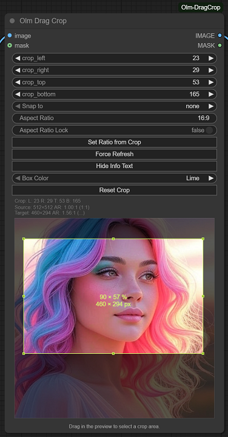

# Olm DragCrop for ComfyUI



An interactive image cropping node for ComfyUI, allowing precise visual selection of crop areas directly within your workflow. This node is designed to streamline the process of preparing images for various tasks, ensuring immediate visual feedback and control over your image dimensions.

- **Author:** Olli Sorjonen
- **GitHub:** https://github.com/o-l-l-i
- **X:** https://x.com/Olmirad
- **Version:** 1.0.1 (Added snap feature)

---

## ✨ What Is This?

**Olm DragCrop** is a lightweight and very responsive real-time cropping node for ComfyUI, with emphasis on smooth UX. It enables you to define a crop area by dragging and resizing a box directly on your image preview within the node graph. Perfect for quickly isolating regions of interest, preparing data for complex image-based workflows, or refining image compositions.

No need to calculate pixel offsets manually or jump to external image editors – you can visually select, adjust, and apply crops without leaving ComfyUI or evaluating the graph until you're ready.

Use it for:
* Precise visual cropping of images
* Preparing source images for inpainting/outpainting
* Streamlining workflows that require image dimension control

---

## 🎨 Features
* **Real-time:** Fast and fluid crop box movement within the node, making it enjoyable to test different compositions.
* **Real-time Feedback:** Statistics are updated instantly as you drag, with pixel dimensions and percentage displayed on the box.
* **Interactive Crop Box:** Drag, move, and resize a crop box directly on the image preview within the node.
* **Visual Handles:** Clearly visible handles on corners and edges for intuitive resizing.
* **Color presets:** Multiple preset colors for the crop box to suit your content and taste.
* **Numeric Input Synchronization:** Fine-tune crop values using synchronized numeric input widgets for `Left`, `Right`, `Top`, and `Bottom` offsets. Changes in the UI update the box, and dragging the box updates the UI.
* **Flexible Cropping:** Define crop regions by drawing a new box, or by resizing/moving an existing one.
* **Mask Support:** Basic mask data to pass through.
* **Aspect Ratio Locking:** Define aspect ratio with numerical value (0.5, 1, 2.0) or aspect ratio (4:3, 16:9).
* **Pixel snap:** Align crop edges to a grid by selecting a snap value (2-64) from the "Snap to" dropdown - select "none" to disable snapping.
* **Image Handling:**
    * Loads and displays images from upstream nodes.
    * Automatically adjusts internal dimensions to match the loaded image.
    * Resets crop to full image on new image load or resolution change from backend.
* **Customization:** Change the crop box color from a predefined set of options.
* **Informative Display:** Toggle on/off the display of percentage and pixel dimensions directly on the crop box.
* **Smart UX:**
    * Node auto-resizes to reasonably fit the image preview.
    * Handles are designed to be easily clickable, scaling with zoom for consistent interaction.
* **Persistence:** Crop box position and image dimensions persist across UI and backend restarts, maintaining your last used crop settings.
* **Reset Functionality:** Easily reset the crop box to the full image dimensions with a dedicated button.

---

## 📦 Installation

Clone this repository into your `custom_nodes` folder.

```bash
git clone https://github.com/o-l-l-i/ComfyUI-Olm-DragCrop.git
```

```bash
Your folder should look like:

ComfyUI/
└── custom_nodes/
    └── ComfyUI-Olm-DragCrop/
        ├── __init__.py
        ├── olm_dragcrop.js
        └── ... (other files)
```

Restart ComfyUI to load the new node.
There are no extra dependencies - it works out of the box.

---

## 🧪 Basic Usage

1. Add the Olm DragCrop node from the node search menu.
2. Connect an image source (e.g., Load Image) to the input.
3. Run the graph once.
4. Once an image is loaded, a transparent overlay with a crop box will appear.
5. To define a new crop: Click and drag anywhere inside the image preview but outside the existing crop box (if any) to draw a new rectangle.
6. To move an existing crop: Click and drag the center area of the crop box.
7. To resize an existing crop: Click and drag one of the corner or edge handles.
8. Use the crop_left, crop_right, crop_top, crop_bottom numeric widgets to fine-tune your crop coordinates.
9. The node's output will be the cropped image, ready for further processing in your workflow.

---

⚠️ Known Limitations
- **You need to run the graph once to get an image preview from upstream.**
  - This is a technical limitation I could not get around.
  - I had realtime update for Load Image node as a special case, but I dropped it to avoid ambiguity/confusion.
- No built-in aspect ratio locking yet!
- Only supports a single crop region per node.

---

## 💬 Notes

This extension is experimental and under active development. Functionality, file formats, and behavior may change without notice, and compatibility with future updates is not guaranteed. Use at your own risk, especially in production workflows.

Back up your projects frequently. Feedback, bug reports, and suggestions are always welcome - but expect breakage, quirks, and rough edges. This tool does what I need right now; future updates may be irregular depending on available time.

---

## License & Usage Terms

Copyright (c) 2025 Olli Sorjonen

This project is source-available, but not open-source under a standard open-source license, and not freeware.
You may use and experiment with it freely, and any results you create with it are yours to use however you like.
However:

Redistribution, resale, rebranding, or claiming authorship of this code or extension is strictly prohibited without explicit written permission.

Use at your own risk. No warranties or guarantees are provided.

The only official repository for this project is: 👉 https://github.com/o-l-l-i/ComfyUI-Olm-DragCrop

---

## Author

Created by [@o-l-l-i](https://github.com/o-l-l-i)